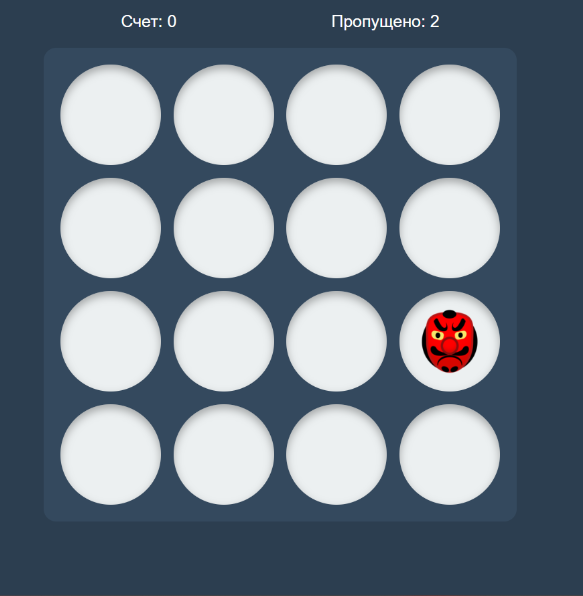

# 🎮 Goblin Game

Браузерная игра на чистом JavaScript.

## Демо

[](https://github.com/stanislav2602/goblin-game-2/actions/workflows/deploy.yml)

[Открыть игру](https://stanislav2602.github.io/goblin-game-2/)

## Скриншот



## Что демонстрирует

- Чистый JavaScript (ES6+)
- Игровая логика и обработка событий
- Сборка через Webpack
- Линтинг через ESLint
- CI через GitHub Actions

## Технологии

JavaScript, Webpack, ESLint, GitHub Actions

## Запуск

```bash
npm install
npm start
